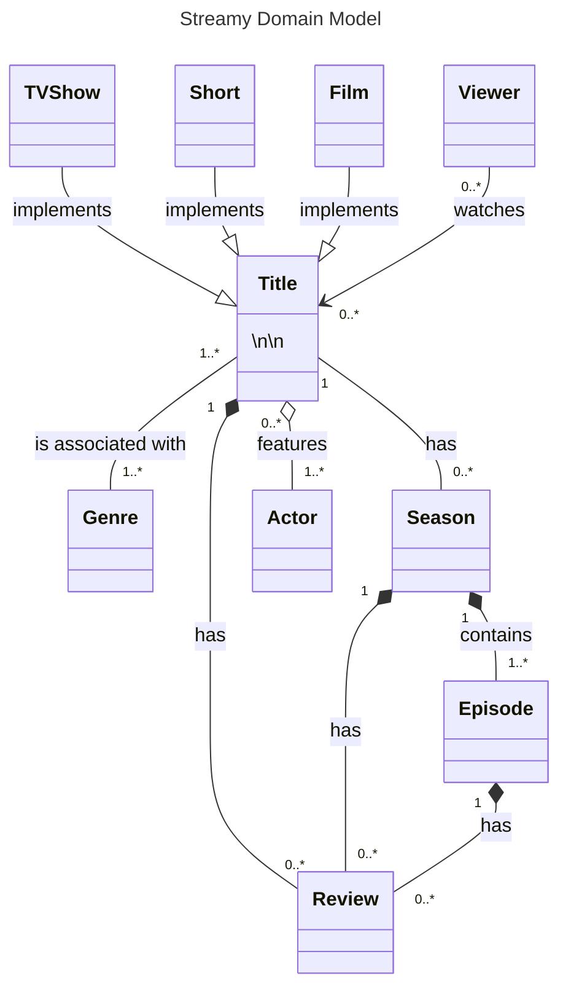

# Domain

```mermaid
---
title: Streamy Domain Model
---
classDiagram
    Title "1..*" -- "1..*" Genre: is associated with
    Title "1" -- "0..*" Season: has
    Title "1" *-- "0..*" Review: has
    Title "0..*" o-- "1..*" Actor: features
    %% Added to improve readability
    Title: \n\n
    link Title "https://www.google.com" _blank

    TV Show --|> Title: implements
    Short --|> Title: implements
    Film --|> Title: implements
    
    Viewer "0..*" --> "0..*" Title: watches

    Season "1" *-- "0..*" Review: has
    Season "1" *-- "1..*" Episode: contains

    Episode "1" *-- "0..*" Review: has
```

